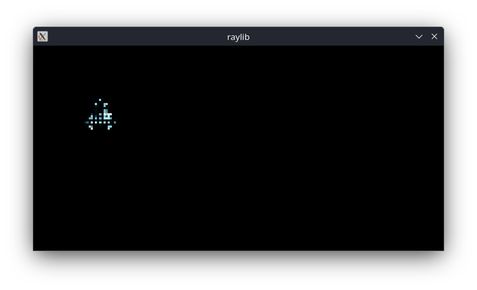

c++ raylib space shooter,
 

(Compile Command Linux) g++ main.cpp player.cpp scene.cpp game_object.cpp -o main -Iinclude -Llib -lraylib

 
 (run) ./main

todo:

-change assests

-make levels

-add movement

SpaceShooter (v0.1)

